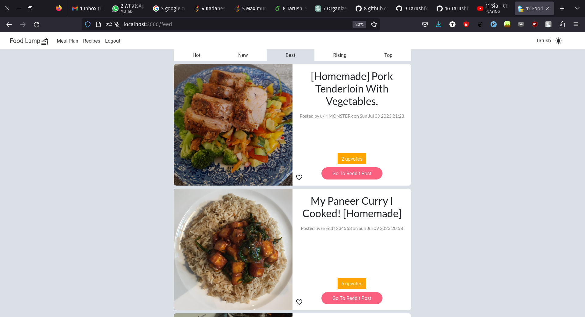
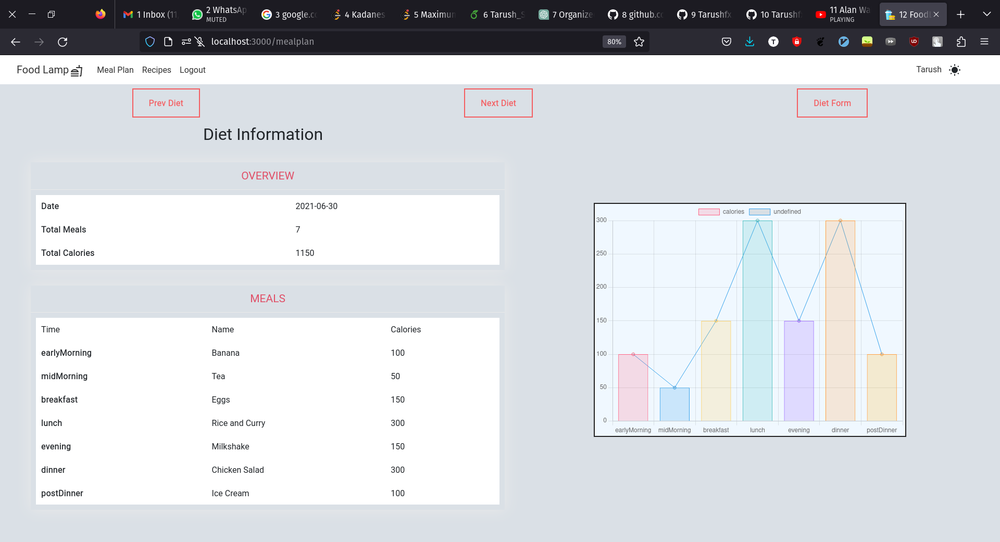
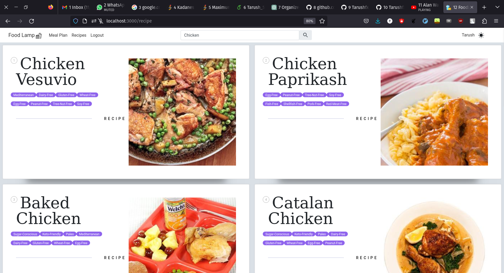

# FoodLamp

> **_The Ultimate FoodGram minus Social media_**

Have you frequently found yourself scrolling through Instagram liking food pictures left n right. Only to find yourself stuck wishing to find the recipe?  
...And you are health conscious?  
You have reached the right place! yay!

Foodlamp is the all in one solution for all your waffles!

The Social media can be quite distracting sometimes when you specially want to just look at the food! Yumm😍

Features:

- All about food and recipes
- Like and Save recipes
- Create Diet plans and Stay on track with your fitness journey
- Amazing diet graphs

Technologies used:

- **Stack**: MERN
- **Charts**: Chartjs
- **Styling**: Bootstrap and Sass
- **Posts**: Reddit API
- **Diet**: Edamam API

## Link to the Site [FoodLamp]()

\*\* The Site is down due to pricing issues of Heroku

### Frontend hosted on Netlify

### Backend Hosted on Heroku

Snapshots:

Landing Page:

Graphs:

Recipes:

Happy Foodlamping!!
